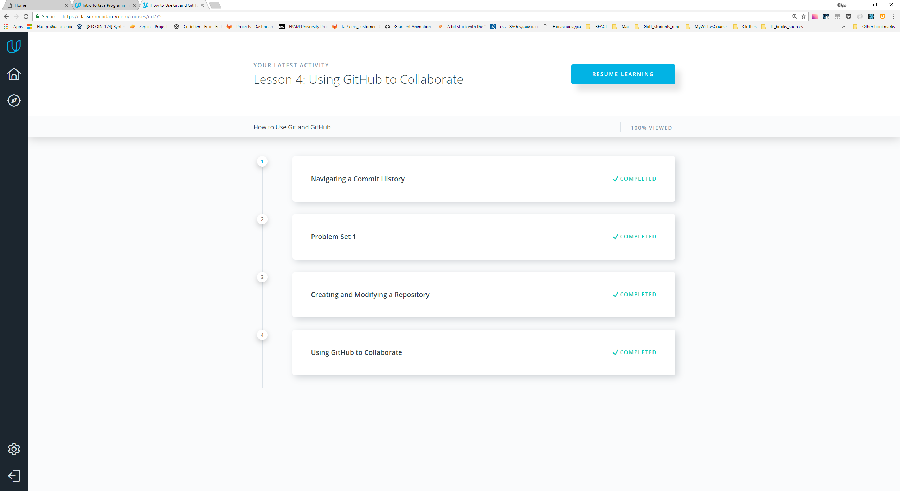
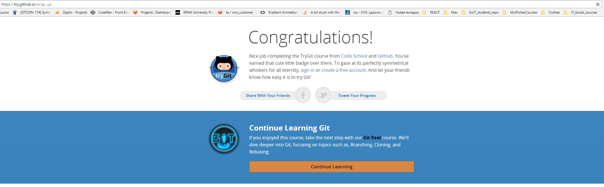

# kottans-frontend-2019

# Task 0 

- thank you for this great course
- I learned some new features, especially the principal of how git works and its history
- learned some new commands
- repeated some info

