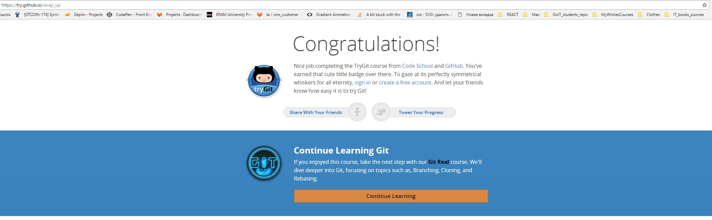
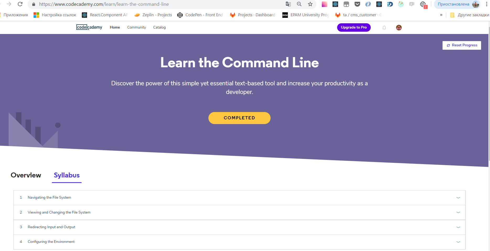
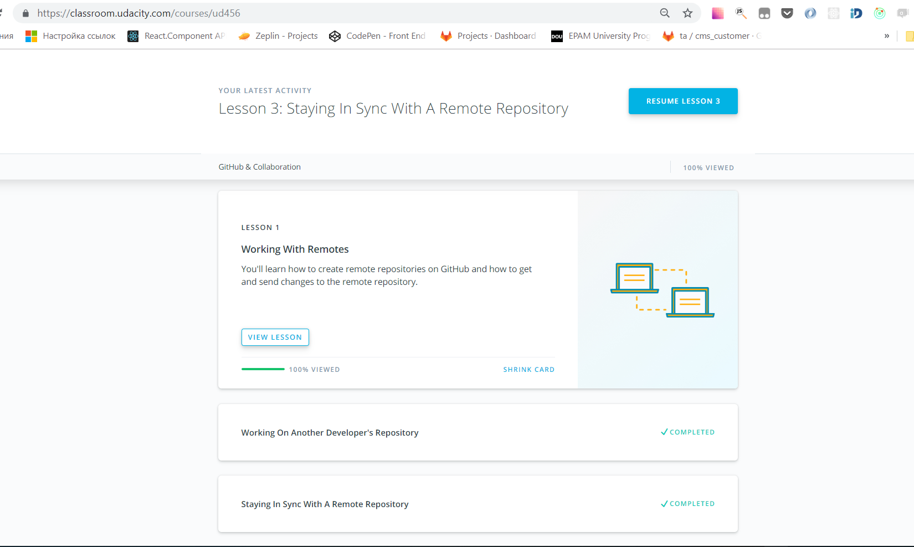
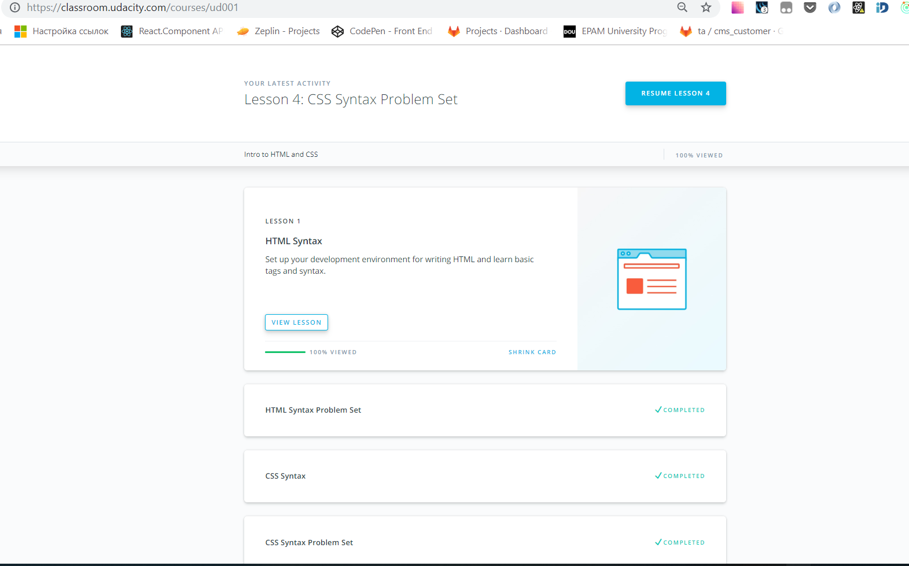
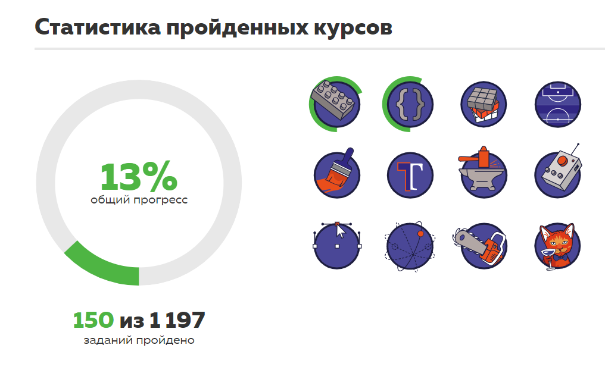

# kottans-frontend

# Task_1_git_intro

- thank you for this great course
- I learnt some new features, especially the principal of how git works and its history
- learnt some new commands
- repeated some info

:paperclip: 
:paperclip: 

## Linux CLI, and HTTP

- great course!!! Thank you!!!

:paperclip: 

## Git Collaboration

- Guys, thank you for this course! It's amazing and completely useful! I use many commands at my work, sometimes even don't understand how they really work, but now I understand all of them under the hood!

:paperclip: 
:paperclip: 

## Intro to HTML and CSS

- Thank you for course! To be honest I've just repeated what I use everyday :)

:paperclip: 
:paperclip: 
