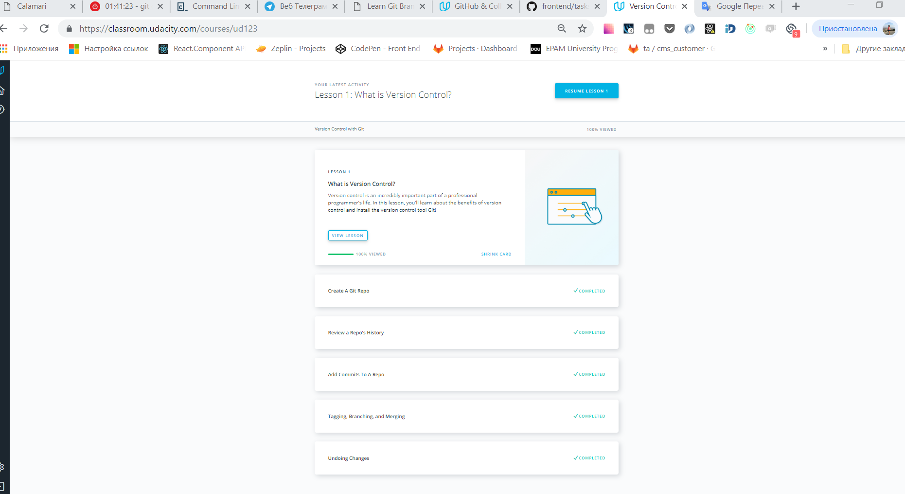
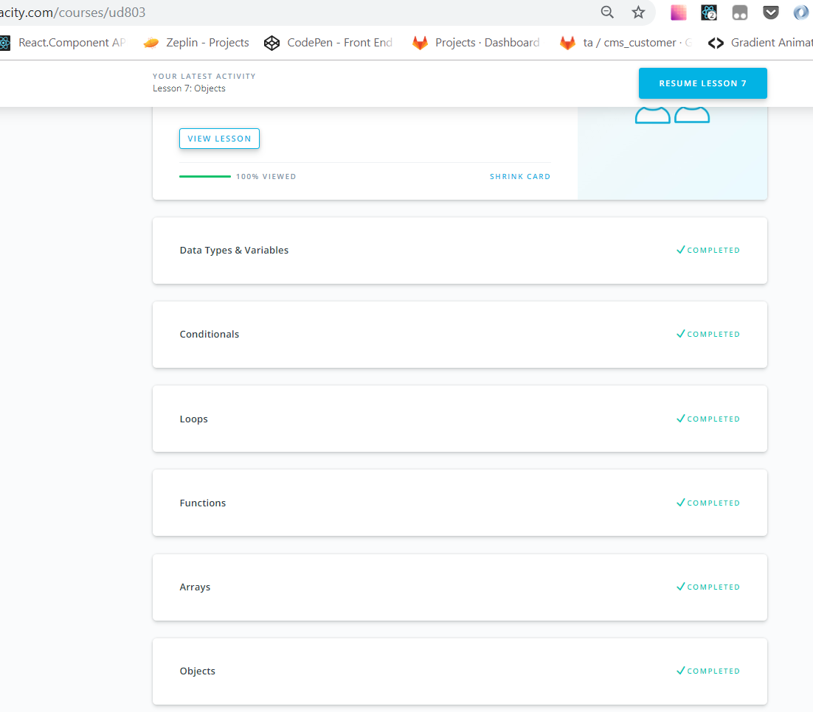
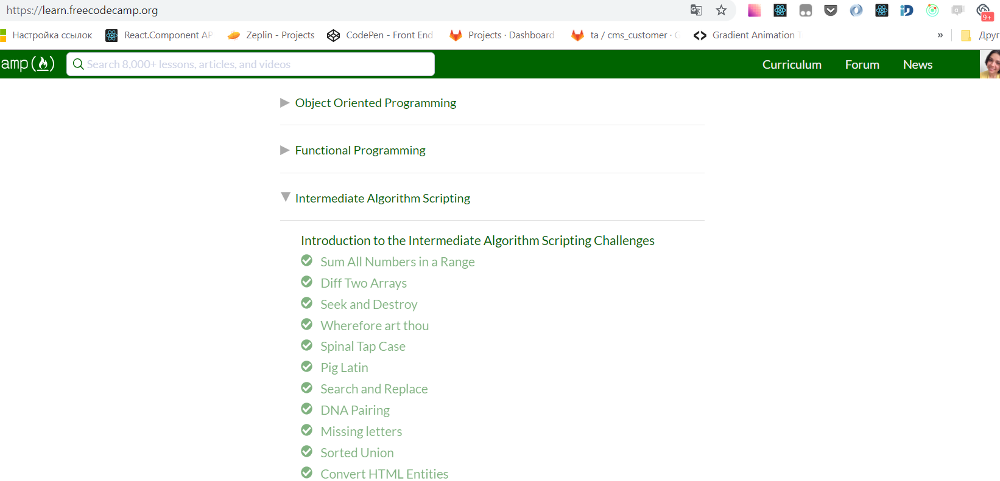
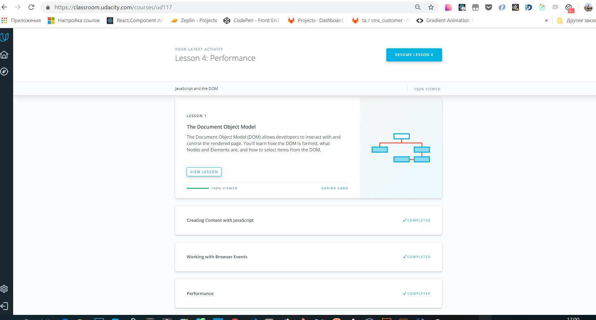
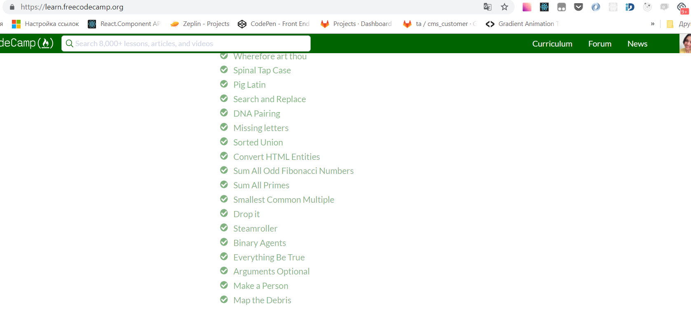
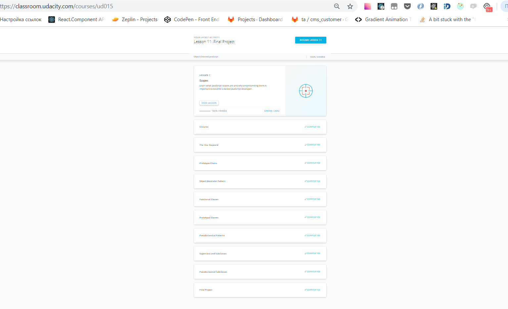

# kottans-frontend

# Task_1_git_intro

- thank you for this great course
- I learnt some new features, especially the principal of how git works and its history
- learnt some new commands
- repeated some info

:paperclip: 
:paperclip: 

## Linux CLI, and HTTP

- great course!!! Thank you!!!

:paperclip: 

## Git Collaboration

- Guys, thank you for this course! It's amazing and completely useful! I use many commands at my work, sometimes even don't understand how they really work, but now I understand all of them under the hood!

:paperclip: 
:paperclip: 

## Intro to HTML and CSS

- Thank you for course! To be honest I've just repeated what I use everyday :)

:paperclip: 
:paperclip: 

## Responsive Web Design

- Thank you for course! Honestly I've just refreshed my knowledge, because course is too basics, but anyway it's so good enough to really understand of responsive web design main concept! :)

:paperclip: 
:paperclip: 

## JS Basics

- Thank you for course from Udacity! It helps me to resfresh my knowledge in JS, especially some tricky points :)
FE intermediate algorithm tasks were enough challenging for me, but anyway really cool !!! Thanks :)

:paperclip: 
:paperclip: 

## JS DOM

- Thank you for course JS_DOM ! It helps me to resfresh my knowledge in DOM, especially some tricky points, and it was suprisingly for me to know about createDocumentFragment() method :)
- What about FE intermediate algorithm, tasks were difficult, sometimes I should see some hints, but know I understand in what direction I should work. Thanks :)

:paperclip: 
:paperclip: 

- Thank you for this practical task! I understand that there are some points on which I should work!

### [Demo](https://olgafrontend.github.io/kottans-frontend/task_js_dom/practice_js_dom/) |  [Code](https://github.com/OlgaFrontend/kottans-frontend/tree/master/task_js_dom/practice_js_dom)
Reviewed and approved by @AMashoshyna

## JS-PRE-OOP

- Thank you for this task! I've never encountered with OOP in real life and understand all interesting ahead!!!

### [Demo](https://olgafrontend.github.io/kottans-frontend/task_js_pre-oop/) |  [Code](https://github.com/OlgaFrontend/kottans-frontend/tree/master/task_js_pre-oop)
Reviewed and approved by @OleksiyRudenko

## Object Oriented JS

- Thank you for OOP course from Udacity! As I mentioned above I've never encountered with OOP in real life, but I know some basics definitions such as prototype, inheretance, encapsulation and so on, but before this course I didn't realise how all these things work together. This course clarifies to me all main points about OOP. To be honest OOP is not so difficult in practice, but there are some tricky things, for example keyword 'this', scope etc, which sometimes can confuse beginners, but I think practice can help to cope with these challenges. Again THANK YOU so much!!!

:paperclip: 

### [Demo Frogger-Game](https://olgafrontend.github.io/kottans-frontend/frogger-game/) |  [Code Frogger-Game](https://github.com/OlgaFrontend/kottans-frontend/tree/master/frogger-game)
Reviewed and approved by @AMashoshyna

## OOP Exercise

- Thank you for this task! It is helped me to understand OOP concepts much deeper and improve my tech skills! I trained to use classes from ES6 and its methods!

### [Demo](https://olgafrontend.github.io/kottans-frontend/task_js-oop-practice/) |  [Code](https://github.com/OlgaFrontend/kottans-frontend/tree/master/task_js-oop-practice)

## Memory Pair Game

### [Demo](https://olgafrontend.github.io/kottans-frontend/task_memory-game/) |  [Code](https://github.com/OlgaFrontend/kottans-frontend/tree/master/task_memory-game)

## Friends App

